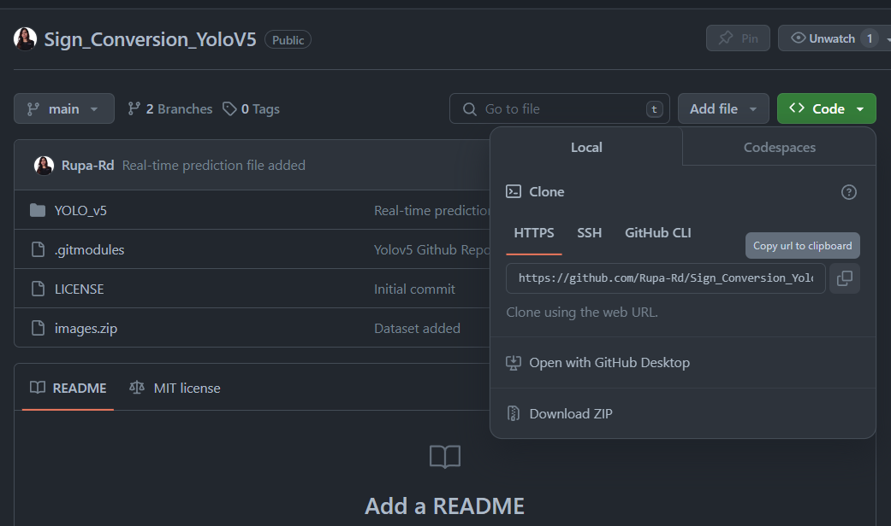
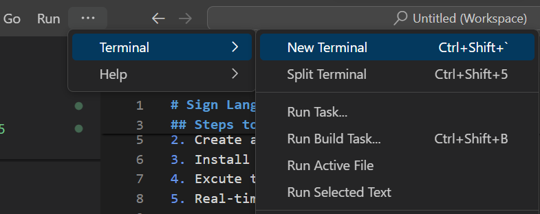
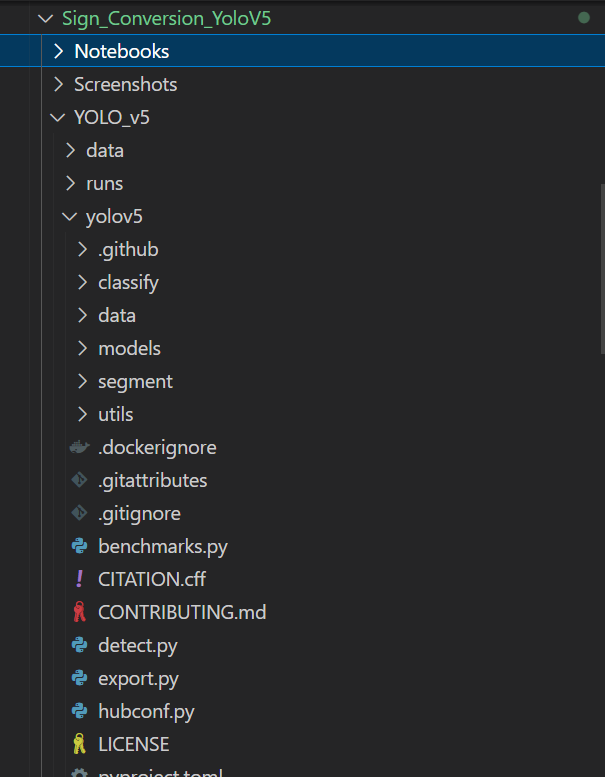
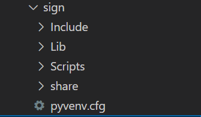
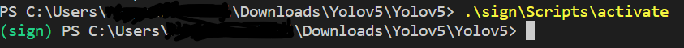
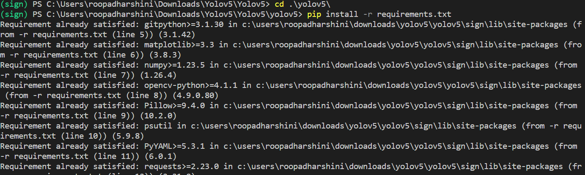
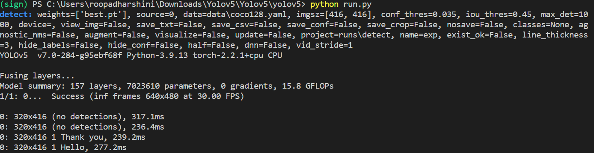

# Sign Language Detector
This project aims to develop a real-time sign language detection and translation system that bridges the communication gap between the hearing-impaired community and the general public. The system will utilize computer vision and machine learning techniques to recognize and interpret sign language gestures, converting them into words.
## Steps to detect
1. Clone the Repository
2. Create a virtual environment
3. Activate the virtual environment
4. Install the requirements
5. Excute the program

### Clone the repository
<strong>Clone the current repository by following the steps given below:</strong>  
1. Click Code -> Local -> Https -> Copy to clipboard  

 
2. Go to you local machine -> Open VS Code  
3. Open Terminal
 
 
4. Paste the command  
`git clone https://github.com/Rupa-Rd/Sign_Conversion_YoloV5.git`
5. Check whether all the files present in the repository got cloned into your local machine

### Create a Virtual Environment
In the Terminal type 
`python -m venv sign` 
This will create a python virtual environment named `sign`

### Activate the Virtual Environment
In the terminal type  
`sign\Scripts\activate`  

### Install the Requirements
After activating the virtual environment, install the requirements 
`cd yolov5`   
`pip install -r requirements.txt`

### Excute the Program
This command will execute the real-time sign language detection  
`python run.py`

## Output
